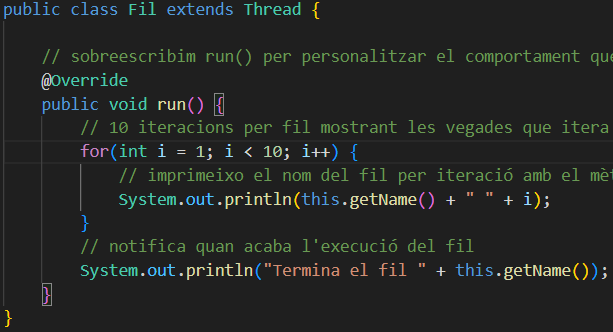
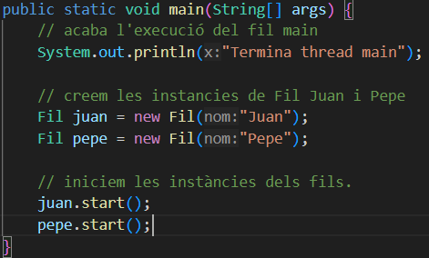
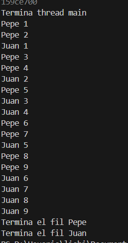

# EXECUCIONS FETS I RESULTATS OBTINGUS:

Per aquesta activitat ens caldrà realitzar varies execucions del nostre programa Principal.java. A partir d'aquest, es crearan dues instàncies 
de tipus Fil per Juan i Pepe. S'intentarà que les execucions simulin al 
màxim de semblant als comportaments 1, 2 i 3.

### COMPORTAMENT PER DEFECTE

He provat una primera execució dels fils per observar quins són els comportaments sense haver interferit en les execucions. Aparentment no estan intercalats equitativament, ni tenen prioritats l'un per sobre de l'altre.

#### SORTIDA:

### COMPORTAMENT 1

Els fils Juan i Pepe s'executen intercaladament de forma equitativa (més o menys). 

#### SORTIDA:

### COMPORTAMENT 2

Ara es prioritza el fil d'en Pepe per sobre den Juan, passant-li el paràmetre de prioritat màxima per a que s'executi primer.
-join (acaba un abans de continuar?) / yield (cedeix lexecució a altres fils)

#### SORTIDA:

### COMPORTAMENT 3

L'ordre d'execució ara són estrictament alterns.

#### SORTIDA: