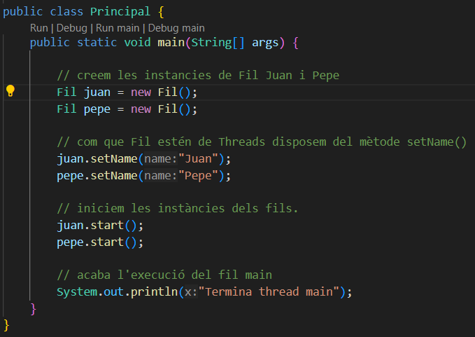
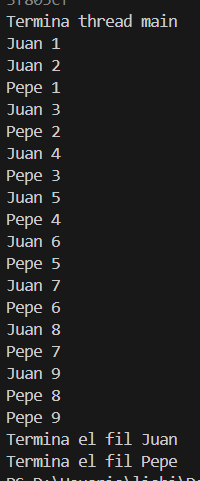
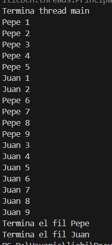
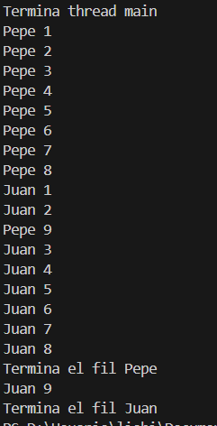
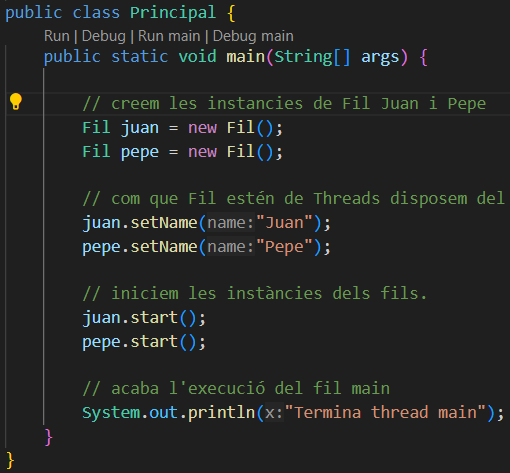
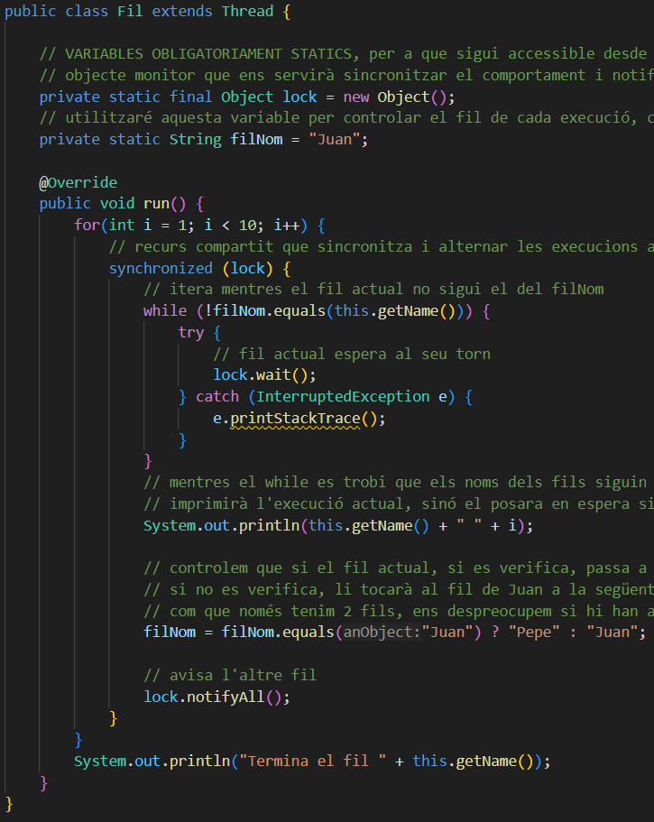
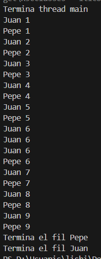

# EXECUCIONS FETS I RESULTATS OBTINGUS:

Per aquesta activitat ens caldrà realitzar varies execucions del nostre programa Principal.java. A partir d'aquest, es crearan dues instàncies 
de tipus Fil per Juan i Pepe. S'intentarà que les execucions simulin al 
màxim de semblant als comportaments 1, 2 i 3.

### COMPORTAMENT 1

Els fils Juan i Pepe s'executen intercaladament de forma equitativa (més o menys). He provat una primera execució dels fils per observar quins són els comportaments sense haver interferit en les execucions.

Definim el comportament del mètode run() sobreescrit de la classe Fil que hereda o esten de Thread, que mitjançant 9 iteracions, imprimeix el nom del fil amb el fetName() de la instància actual i el valor numèric de la iteració.

Imprimeixo la finalització de l'execució del fil fora del for indicant el nom amb getName() novament.

Desde la classe Principal es creen dues instàncies tipus Fil, amb les variables de juan i pepe i li assignem noms als fils amb el mètode setName() heredat de la classe Thread.

A continuació executem els fils amb start().

#### SORTIDA:

### COMPORTAMENT 2

Ara es prioritza el fil d'en Pepe per sobre d'en Juan, passant-li el paràmetre de prioritat màxima per a que s'executi primer.

Per aquest comportament només modificarem la classe Principal, indicant amb la constant de Thread, MAX_PRIORITY/MIN_PRIORITY amb el mètode setPriority() heredat de la classe Thread i a continuació executem amb start() per a les dues instàncies.

#### SORTIDA:

He tingut que executar varies vegades, però mai han sigut exactes, he aconseguit aproximar-m'hi el màxim que he pogut i això demostra que utilizar el setPriority() no garanteix sempre la prioritat d'un fil, també depèn del sistema operatiu. Per això adjunto 3 casos de sortida d'execucions pròximes al que s'espera.

  

### COMPORTAMENT 3

L'ordre d'execució ara són estrictament alterns. Per això hem esborrat les prioritats del comportament 2 a la classe Principal i ho hem deixat com el cas del comportament 1, però els canvis els fem a la classe Fil.

Creo dues variables globals que siguin statics per després poder accedir amb el monitor, una variable filNom que indica quin serà el nom del pròxim fil a executar-se, un altre variable lock de tipus Objecte creant directament la instància en el context global.

Dins del bloc del for, faig ús del synchronized amb el monitor lock de tipus Object, dins del bloc fem ús del while en que valora que mentres el nom actual del fil no sigui igual al del nom del fil global guardat, entry al bloc del try per posar el lock en espera amb el mètode wait().

En cas de que el while no es verifiqui i els noms dels fils siguin iguals, imprimeix una iteració i a continuació valora si el nom del fil actual equival a "Juan" si es verifica, passa al torn d'en Juan reassignant el nom del fil a la variable global filNom, si no es verifica la ternària es que el pròxim torn hauria de ser el fil d'en Juan, per tant es reassigna el nom.

He considerat possible la ternària per aquest cas perquè sé amb certesa de que només hi hauran aquestes dues cadenes per nom.

Un cop modificat el filNom, amb el monitor lock cridem el mètode notifyAll() per avisar a l'altre fil.

Finalment, al acabar les iteracions notifica la finalització de l'execució dels fils.

#### SORTIDA:

