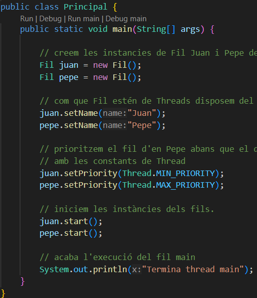
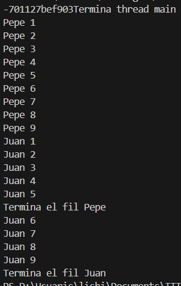

# EXECUCIONS FETS I RESULTATS OBTINGUS:

Per aquesta activitat ens caldrà realitzar varies execucions del nostre programa Principal.java. A partir d'aquest, es crearan dues instàncies 
de tipus Fil per Juan i Pepe. S'intentarà que les execucions simulin al 
màxim de semblant als comportaments 1, 2 i 3.

### COMPORTAMENT 1

Els fils Juan i Pepe s'executen intercaladament de forma equitativa (més o menys). He provat una primera execució dels fils per observar quins són els comportaments sense haver interferit en les execucions. 

#### SORTIDA:

### COMPORTAMENT 2

Ara es prioritza el fil d'en Pepe per sobre d'en Juan, passant-li el paràmetre de prioritat màxima per a que s'executi primer.

#### SORTIDA:

He tingut que executar varies vegades, però mai han sigut exactes, he aconseguit aproximar-m'hi el màxim que he pogut i això demostra que utilizar el setPriority() no garanteix sempre la prioritat d'un fil, també depèn del sistema operatiu. Per això adjunto 3 casos de sortida d'execucions pròximes a lo que s'espera.

  

### COMPORTAMENT 3

L'ordre d'execució ara són estrictament alterns.

#### SORTIDA: