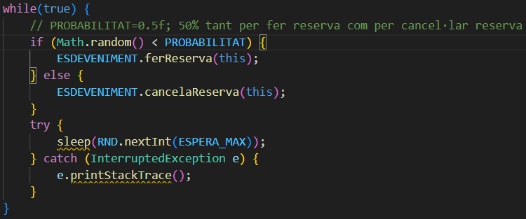
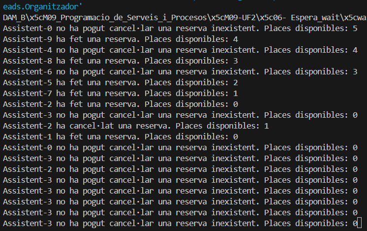

# PREGUNTES TEÒRIQUES 06_ESPERA_WAIT:

Respostes a les preguntes teòriques de la pràctica 06 Espera Wait.

#### 1. Per què s'atura l'execució al cap d'un temps?
====================================================

Després d'executar el codi hem pogut comprobar que l'execució es para igualment tot i que estiguem utilitzant un while(true), que no es el mateix parar-se que la finalització del programa.

Això es degut a que tot i que el true fomenti la reiteració després de que un fil o assistent hagi fet una reserva o una cancel·lació.

Torna a executar-se les mateixes instruccions fins que finalment totes les places disponibles es queden esgotades fins arribar a 0, en que finalment en entrar tots els fils per ferReserva() segons les probabilitats, i es trobi en que hi han 0 places disponibles.

Es queden esperant indefinidament tots els fils i no arriba cap notifyAll() perquè cap que tingui una reserva existent ha entrat per cancelaReserva().

#### 2. Què passaria si en lloc de una probabilitat de 50%-50% fora de 70% (ferReserva)-30% (cancel·lar)? I si foren al revés les probabilitats? → Mostra la porció de codi modificada i la sortida resultant en cada un dels 2 casos
====================================================

##### CAS 1: Probabilitat 70% (ferReserva) - 30% (cancelaReserva)

##### CAS 2: Probabilitat 30% (ferReserva) - 70% (cancelaReserva)

#### 3. Perquè creus que fa falta la llista i no valdria només amb una variable sencera de reserves?
====================================================

