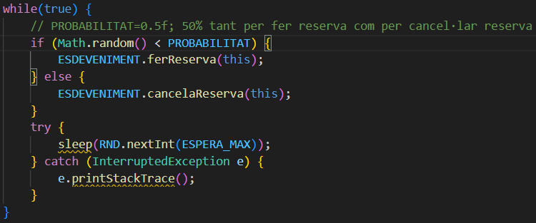
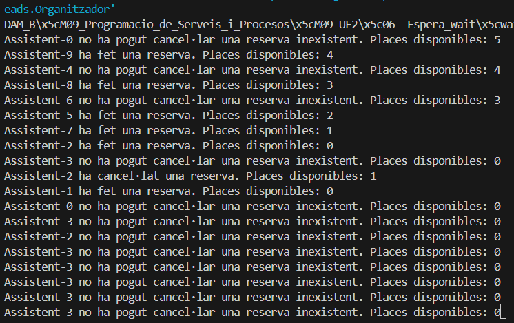
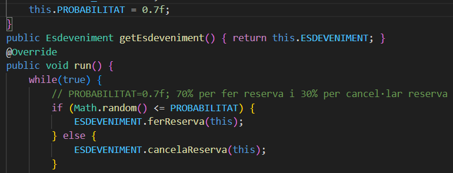
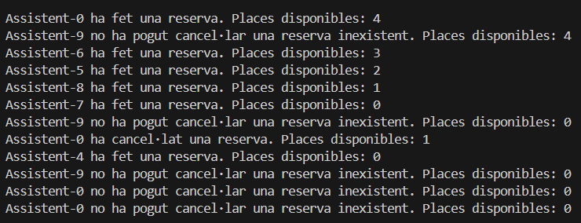
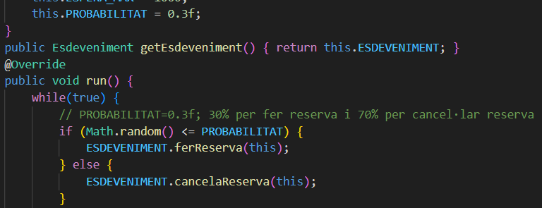
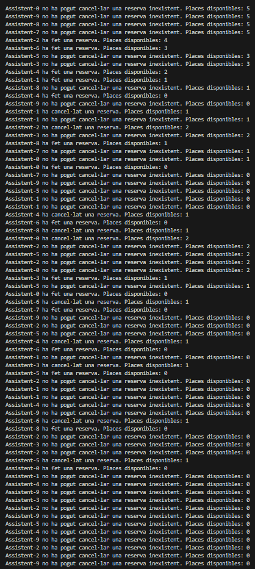

# PREGUNTES TEÒRIQUES 06_ESPERA_WAIT:

Respostes a les preguntes teòriques de la pràctica 06 Espera Wait.

#### 1. Per què s'atura l'execució al cap d'un temps?
---

Després d'executar el codi hem pogut comprobar que l'execució es para igualment tot i que estiguem utilitzant un while(true), que no es el mateix parar-se que la finalització del programa.

Això es degut a que tot i que el true fomenti la reiteració després de que un fil o assistent hagi fet una reserva o una cancel·lació.

Torna a executar-se les mateixes instruccions fins que finalment totes les places disponibles es queden esgotades fins arribar a 0, en que finalment en entrar tots els fils per ferReserva() segons les probabilitats, i es trobi en que hi han 0 places disponibles.

Es queden esperant indefinidament tots els fils i no arriba cap notifyAll() perquè cap que tingui una reserva existent ha entrat per cancelaReserva().

#### 2. Què passaria si en lloc de una probabilitat de 50%-50% fora de 70% (ferReserva)-30% (cancel·lar)? I si foren al revés les probabilitats? → Mostra la porció de codi modificada i la sortida resultant en cada un dels 2 casos
---

##### CAS 1: Probabilitat 70% (ferReserva) - 30% (cancelaReserva)

En aquest cas el 70% de ferReserva(), les vegades que un fil o assistent que és executat, intentarà fer una reserva si hi han places disponibles.

En cas de que no quedin places, es quedaràn en espera amb el wait() en menor temps els fils que queden i tots els que reiteren mentres entrin amb la probabilitat del 70% de fer una reserva, perquè les places disponibles s'esgoten més ràpid per l'intent de reserva que no pas la probabilitat de cancel·lació de reserves.

##### CAS 2: Probabilitat 30% (ferReserva) - 70% (cancelaReserva)

En el cas del 30% de ferReserva(), l'execució tardarà molt més en parar-se perquè la probabilitat de cancel·lar una reserva és major que la de fer reserva i que només un cop esgotades totes les places, és quan es posa en espera l'execució de tots els fils que entrin perReserva().

#### 3. Perquè creus que fa falta la llista i no valdria només amb una variable sencera de reserves?
---

La variable de valor enter només controla les places disponibles que té un esdeveniment per poder realitzar reserves. En canvi, no té cap control sobre els assistents que tenen una reserva i que qualsevol pugui cancel·lar una reserva inexistent.

Per tant, la llista d'assistents és imprescrindible per comprobar que aquests existeixen en la llista i que han sigut afegits al fer una reserva, per poder cancel·lar-la de forma atòmica.

Sinó, seria un descontrol alhora de cancel·lar una reserva i qualsevol assistent que no tingui una reserva podría cancel·lar i "alliberar" una plaça que no existeix que dona a pas a la possibilitat de fer més reserves de forma indefinida i es perdria el control del màxim de places disponibles, existents o reservades.